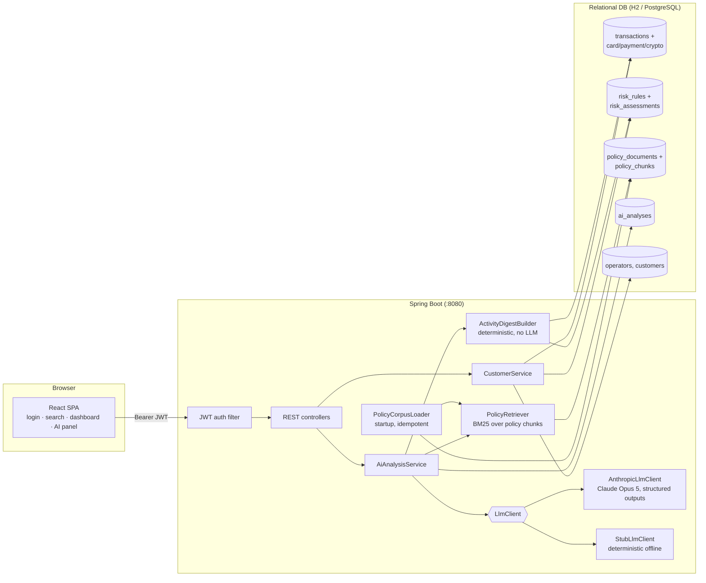

# Customer Activity Analytics

A dashboard for financial-services customer-care operators: search a customer, review their
card / payment / cryptocurrency activity, and run an **AI-powered risk analysis** that grades
the activity (LOW → CRITICAL), explains its findings with evidence, cites the internal
policies it relied on (RAG), and recommends next actions. Every analysis is persisted for
later review.

Built for the PE assignment with **Java 21 · Spring Boot 3 · Hibernate/JPA · Flyway · H2/PostgreSQL ·
React 18 + TypeScript · Anthropic Claude** (with a full offline stub mode).

---

## How to run

Prerequisites: **JDK 21+**, **Maven 3.9+**, **Node.js 20+** (only needed to build/serve the frontend).

### Option A — single jar (recommended for a demo)

```bash
mvn package                     # builds frontend + backend into one runnable jar
java -jar backend/target/customer-activity-analytics-1.0.0.jar
```

Open http://localhost:8080 and sign in. Everything is self-contained: embedded H2 database
(file-based, created under `./data/`), schema + demo data applied by Flyway, policy corpus
indexed at startup, deterministic AI stub active by default.

If you don't have Node installed: `mvn package -Dfrontend.skip=true` builds the backend only
(API still fully usable).

### Option B — development mode

```bash
# terminal 1 - backend on :8080
cd backend && mvn spring-boot:run

# terminal 2 - frontend on :5173 (proxies /api to :8080)
cd frontend && npm install && npm run dev
```

### Enabling the real LLM (Claude)

```bash
export ANTHROPIC_API_KEY=sk-ant-...
java -jar backend/target/customer-activity-analytics-1.0.0.jar
```

The default mode is `AUTO`: with the key present, analyses run on **Claude Opus 5**
(`claude-opus-5`) via the official Anthropic Java SDK; without it, the deterministic stub is
used so the app demos offline. Force a mode with `--app.ai.mode=ANTHROPIC|STUB|AUTO`.
See [docs/AI_DESIGN.md](docs/AI_DESIGN.md) for the full AI design: every LLM call, every
prompt, and why each exists.

### Optional: PostgreSQL instead of H2

```bash
docker compose up -d
java -jar backend/target/customer-activity-analytics-1.0.0.jar --spring.profiles.active=postgres
```

### Demo logins and data

| Operator | Password | Role |
|---|---|---|
| `alice` | `operator1` | OPERATOR |
| `bob` | `operator2` | OPERATOR |
| `carol` | `supervisor1` | SUPERVISOR |

Seven seeded customers, each a distinct risk story (leave the search box empty to list them):

| Customer | Pattern | Expected AI grade |
|---|---|---|
| Marco Deluca | ordinary retail card/SEPA activity | LOW |
| Chen Wei | regular purchases via an approved exchange | LOW |
| Jonas Weber | normal business payments, one large cross-border wire | MEDIUM |
| Amira Haddad | dormancy, then a velocity spike of round-amount P2P transfers | MEDIUM |
| Sofia Marin | card-testing decline burst, night-time CNP spending, gambling MCC | MEDIUM/HIGH |
| Yulia Sorokina | high-value wires to greylist corridors + structuring (3× 9.9k in 26h) | HIGH |
| Daniel Osei | rapid crypto outflow incl. transfers to a listed mixing service | CRITICAL |

### Tests

```bash
cd backend && mvn test        # 27 tests: unit (BM25, stub, pipeline validation/repair) + API integration
cd frontend && npm test       # vitest unit tests
```

---

## Architecture



**AI analysis pipeline** (detailed in [docs/AI_DESIGN.md](docs/AI_DESIGN.md)):

1. **Activity digest** – deterministic Java compacts the customer's full activity (per-type
   totals, corridors, MCCs, crypto counterparties, fired risk rules, notable transactions)
   into a small, traceable text block. Raw rows never reach the LLM.
2. **LLM call 1 – triage & retrieval planning** (structured output): names the salient risk
   signals and formulates 2–6 policy-KB search queries.
3. **Retrieval** – BM25 over the chunked policy corpus with those queries (top-6).
4. **LLM call 2 – risk analysis** (structured output): grades the risk using the retrieved
   classification criteria, produces findings tied to concrete transactions with policy
   citations, and operator-actionable recommendations.
5. **Validation + one repair call** – semantic checks on the output; a single retry carries
   the validation feedback if needed.
6. **Persistence** – the full result (risk level, findings, recommendations, triage signals,
   retrieval queries, policy excerpts used, token usage, latency, model, operator) is stored
   in `ai_analyses` and browsable in the UI's history selector.

## Main design decisions

- **Database schema follows the assignment verbatim** (`transactions` + three subtype tables,
  `risk_rules`, `risk_assessments`), with supporting tables for operators, customers, the RAG
  corpus and persisted analyses. Flyway owns the schema; SQL is portable between H2
  (PostgreSQL mode) and real PostgreSQL — enums are `VARCHAR + CHECK`, JSON payloads are `TEXT`.
- **Entities are association-free**; services assemble aggregates with explicit bulk queries
  (`findByTransactionIdIn`), avoiding one-to-one lazy-loading pitfalls and N+1 queries.
- **LLM behind an interface** (`LlmClient`): the real Anthropic client and the stub receive
  identical inputs and honour identical output contracts, so the entire pipeline —
  digest, retrieval, validation, persistence, UI — is exercised in both modes. The
  assignment explicitly allows stubs; here the stub is the zero-config default and the real
  integration is one env var away.
- **Structured outputs, not JSON-in-prose**: both Claude calls constrain generation to a JSON
  schema derived from Java records (`TriagePlan`, `RiskAnalysisResult`), so parsing is
  type-safe with no regex extraction. A semantic validation layer + one repair call guards
  the remaining failure modes.
- **RAG via lexical BM25, not embeddings** — a deliberate choice: the corpus is ~33 chunks of
  terminology-dense policy text, and the queries are formulated by the LLM itself in the same
  vocabulary, so BM25 retrieval is precise while keeping the app free of external embedding
  services (Anthropic offers no embeddings API) and fully offline-capable. `PolicyRetriever`
  is the seam where a vector store could be swapped in.
- **Policy markdown files are the source of truth**: loaded and chunked (per `##` section)
  into the DB at startup, idempotently by content hash; the BM25 index is rebuilt in memory.
- **Auth**: stateless JWT (HS256, jjwt) with BCrypt password hashes; Spring Security
  filter-chain; `/api/**` requires a token, SPA shell and assets are public.
- **Single artifact delivery**: `mvn package` builds the React app (via local `npm`) and
  serves it from the boot jar, so the demo is one command; a Vite dev-proxy setup remains for
  development.

## Assumptions

- Customer activity is review-window–scoped; the seeded data covers June–August 2026 and the
  digest always analyzes the customer's full stored history.
- Risk assessments (rule firings) are precomputed data produced by an upstream monitoring
  system, as implied by the schema; this app reads them, aggregates a score, and feeds them
  to the AI analysis rather than re-evaluating rule logic.
- Policy documents are internal, invented content written for this assignment; the "known
  mixer address" and jurisdiction lists intentionally match the seeded data so retrieval
  grounding is demonstrable.
- Operator provisioning is out of scope (operators are seeded); roles are informational
  except where noted.
- Amounts are per-currency; no FX conversion is attempted (totals are grouped by currency).
- The AI analysis is decision support for an operator, not an automated decision system: it
  recommends actions defined in the escalation policy and never acts on its own.

## Repository layout

```
├── backend/                     Spring Boot app (Java 21)
│   └── src/main/resources/
│       ├── db/migration/        Flyway: V1 schema, V2 seed data
│       └── policies/            RAG corpus (markdown, chunked at startup)
├── frontend/                    React 18 + TypeScript + Vite SPA
├── docs/AI_DESIGN.md            LLM choice, every call documented, full agent instructions
└── docker-compose.yml           optional PostgreSQL
```
